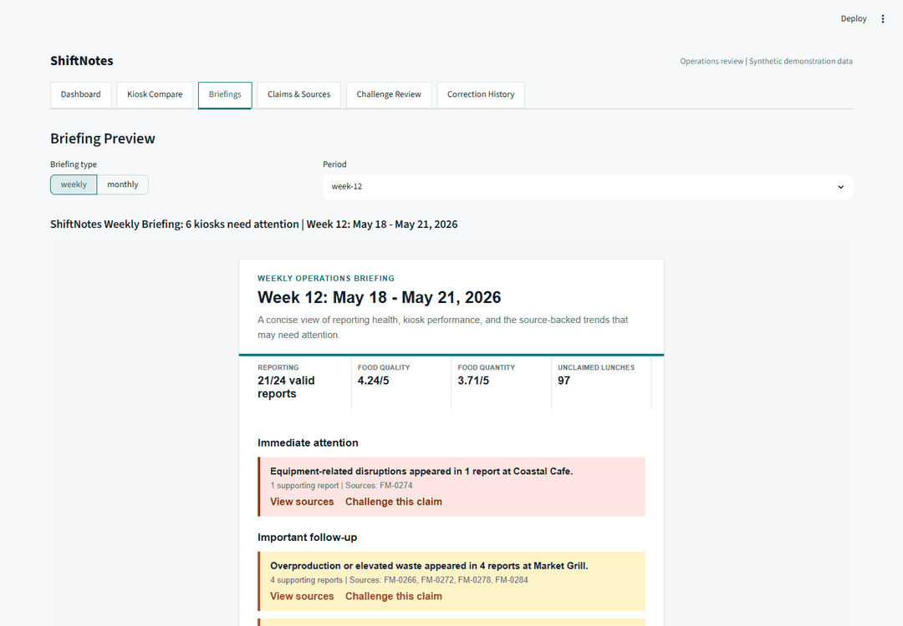

# ShiftNotes

Email-first operations intelligence for food-service shift reports.
ShiftNotes turns individual reports into weekly and monthly briefings with
prioritized findings, kiosk trends, missing-report dates, and inspectable sources.

The manager reads the briefing in email. The dashboard supports leadership
meetings, comparison across kiosks, source inspection, and confirmed corrections.



[Watch the full workflow recording](docs/demo/workflow.webm) |
[Screenshots and reproducible demo](docs/demo/README.md)

## Try It

[Hosted synthetic-data demo](https://shiftnotes.streamlit.app) |
[Demo walkthrough](docs/DEMO_GUIDE.md) | [Documentation](docs/README.md)

From a checkout with [uv](https://docs.astral.sh/uv/) installed:

```powershell
uv sync --locked
uv run streamlit run streamlit_app.py
```

The bundled synthetic demo needs no API keys. Open the local URL printed by
Streamlit. Python 3.13 is pinned for the locked development environment; the
package declares Python 3.11+. See [setup](demo/README.md) for pip instructions.

## What It Does

- Fetches JotForm submissions and maps known shift-report fields into typed records.
- Separates missing reports, invalid submissions, and duplicates.
- Calculates food quality/quantity averages and unclaimed-lunch counts in Python.
- Extracts semantic themes with Groq, validates quoted evidence, and retries or falls back on failure.
- Produces weekly/monthly HTML and plain-text briefings with priority tiers and source links.
- Sends a selected briefing through Gmail after OAuth setup and explicit confirmation.
- Provides date/kiosk filters, trend charts, kiosk comparisons, and source-backed priority review.
- Records a claim challenge, pauses for confirmation, and preserves correction history.

The demo covers 12 weeks and six kiosks: 288 expected reports, 273 submitted
records, 267 valid unique reports, 18 missing slots, three invalid submissions,
and three duplicates. Its evaluation patterns are deliberately planted.

## Where It Came From

I designed ShiftNotes around a reporting problem I observed at work: leadership
read shift notes one by one to decide which issues needed attention. Useful
information was already being collected, but comparing it across kiosks and
weeks required repeated manual review.

The project began as a team class prototype through the Week 8 checkpoint.
From Week 9 onward, I developed this workplace-specific version independently.
I directed the product concept, email-first workflow, source traceability, human
review behavior, and adoption strategy. AI coding tools assisted with
implementation, testing, documentation, and iteration. The earlier team work is
preserved and attributed in the archive.

[Project background and ownership](docs/PROJECT_OVERVIEW.md)

## How It Works

```text
JotForm API -> normalization -> metrics + semantic interpretation
           -> claims and source references -> briefing email
           -> dashboard inspection -> proposed correction -> human confirmation
```

The components work, but this is still an operator-run prototype. Live fetches
write to a separate local data directory; the published demo and briefing commands
use the bundled dataset by default. A scheduled live ingestion-to-email service
has not been connected. [Integration boundaries](docs/INTEGRATIONS.md).

## Form Compatibility

**JotForm is the implemented connector.** Its field labels must match the supported
shift-report aliases. Google Forms, Microsoft Forms, Typeform, and arbitrary CSVs
are not plug-and-play inputs. They would need a connector or importer that maps
their responses to the ShiftNotes schema and preserves source IDs.
Gmail is used for sending briefings, not reading forms from email.

## Verification

```powershell
uv run pytest -q
```

[Feature evidence](docs/FEATURE_INVENTORY.md) and [verification results](docs/VERIFICATION.md)
distinguish automated tests, historical live delivery evidence, and remaining gaps.

## Repository Guide

| Location | Contents |
| --- | --- |
| `streamlit_app.py` | Stable local/hosted app entry point |
| `demo/app.py` | Active Streamlit dashboard and review workflow |
| `demo/src/shiftnotes/` | Ingestion, analytics, AI, email, and stateful workflows |
| `demo/data/final_mock/` | Synthetic reports, evaluation truth, and demo outputs |
| `tests/` | Tests for the active implementation |
| `scripts/` | Reproducible dataset generation |
| `docs/` | Current product and engineering documentation |
| `docs/submissions/` | Class deliverables and technical report |
| `docs/archive/` | Earlier team code, planning, mockup, and superseded material |

## Limits

The public demo is unauthenticated and must remain synthetic. There is no hosted
scheduler, tenant isolation, or production database. Correction interpretation
is deterministic; Groq is used for report extraction, not open-ended correction
reasoning. Unclaimed lunches are a cost-review signal, not verified financial
loss. Time savings and workplace outcomes have not been measured in a pilot.

[Current status and roadmap](docs/PROTOTYPE_STATUS.md) |
[Architecture](docs/ARCHITECTURE_OVERVIEW.md) |
[Publication and archive policy](docs/PUBLICATION.md)
