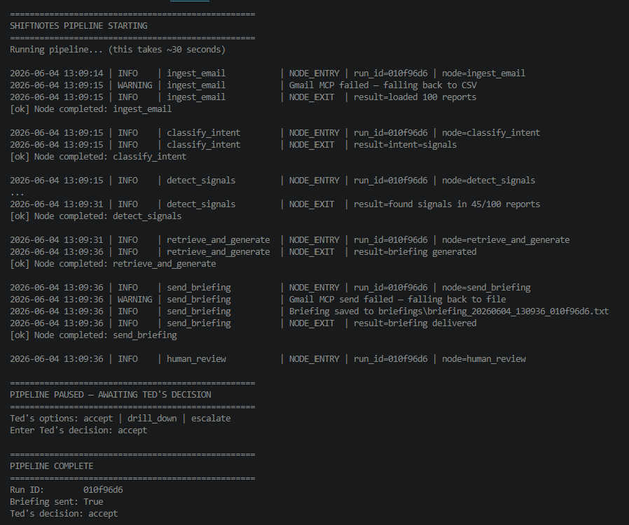
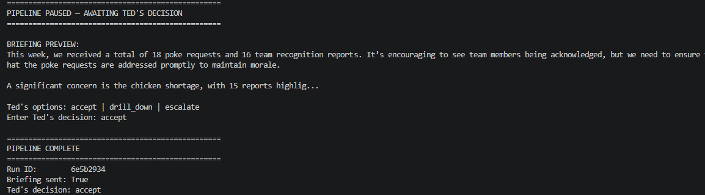
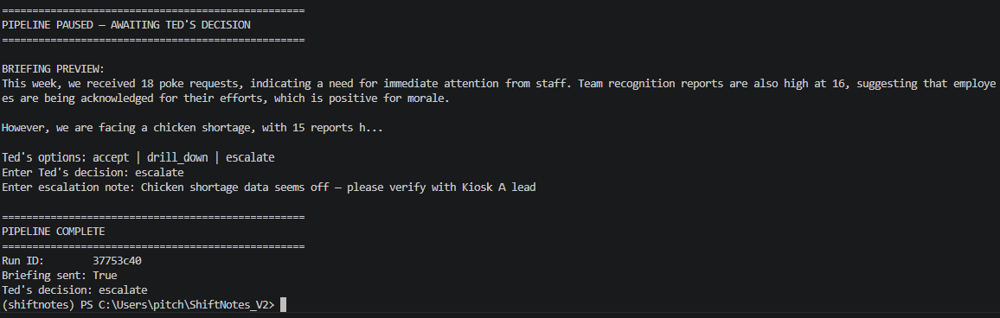
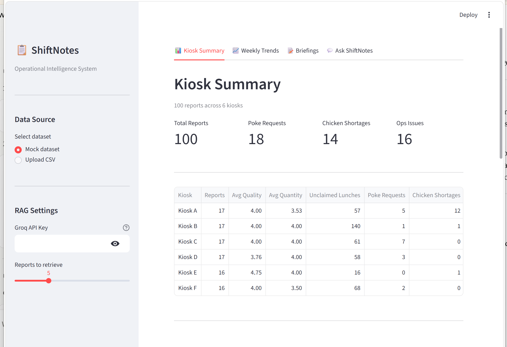
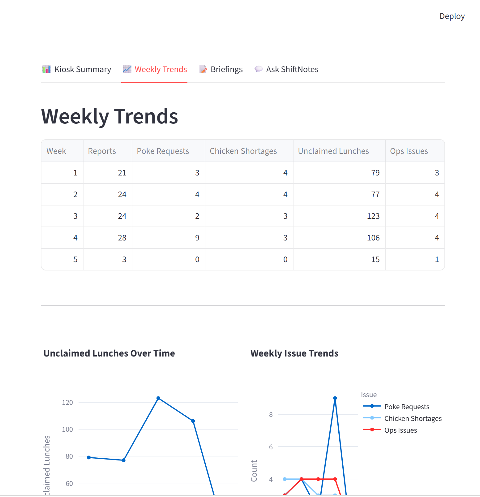
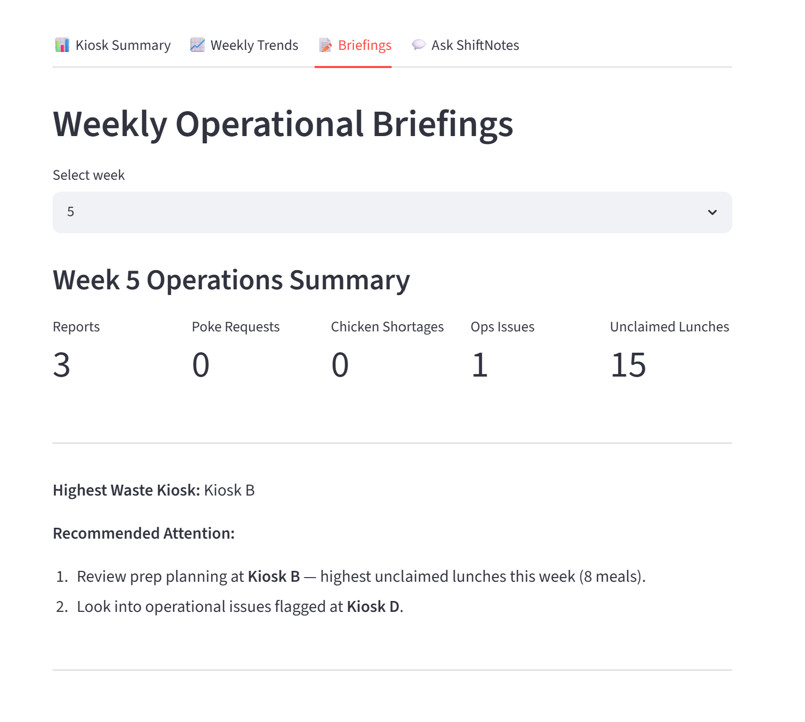
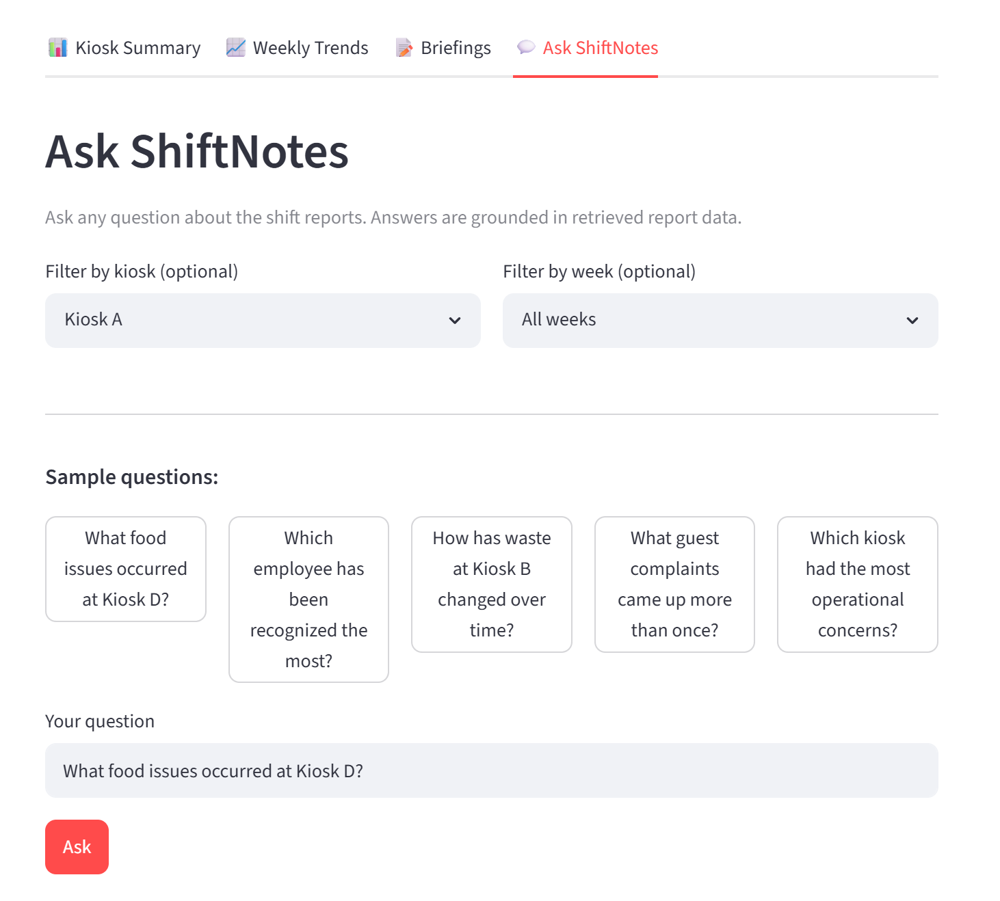
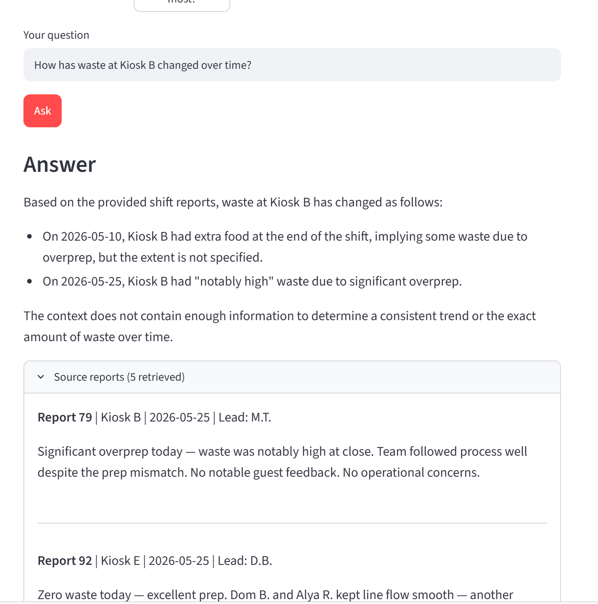
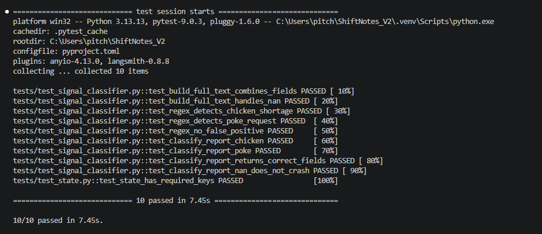

# Week 8 Report — ShiftNotes
**Operational Intelligence Dashboard**
Submitted: Jun 4, 2026

---

## What We Built

ShiftNotes is an AI-driven operational intelligence system that transforms freeform daily shift reports into structured signals, trend summaries, and actionable briefings for operations leadership.

This week we delivered a working end-to-end prototype of the orchestration pipeline, including signal detection, briefing generation, and HITL review. ChromaDB is populated and RAG retrieval is active — Ask ShiftNotes successfully retrieves source reports and generates answers via Groq.

---

## How It Meets Week 8 Requirements

### 1. Finalized SPEC.md + Architecture Diagram
We finalized a full product specification and architecture document before beginning implementation.

**Full Pipeline Diagram:**


```
Shift lead writes report
    ↓ JotForm → Gmail inbox
┌─────────────────────────────────────────────┐
│           LangGraph Orchestration           │
│                                             │
│  Node 1 — ingest_email                      │
│  MCP Gmail reads → CSV fallback             │
│                    ↓                        │
│  Node 2 — classify_intent                   │
│  Route: signals or RAG query                │
│                    ↓                        │
│  Node 3 — detect_signals                    │
│  Hybrid regex + HuggingFace                 │
│                    ↓                        │
│  Node 4 — retrieve_and_generate (RAG)       │
│  ChromaDB search → Groq → briefing          │
│                    ↓                        │
│  Node 5 — send_briefing                     │
│  MCP Gmail → Ted's inbox / file fallback    │
│                    ↓                        │
│  Node 6 — human_review (HITL)               │
│  Ted reads briefing ← LangGraph interrupt   │
└─────────────────────────────────────────────┘
                    ↓
          Understand? (YES/NO)
         ↙                    ↘
    YES                         NO
Take action            Option A — Open Streamlit
                       Ted sees details
                              ↓
                       Accept? (YES/NO)
                      ↙              ↘
                   YES                NO
              Take action      Option B — Escalate
                               Email shift lead
                                     ↓
                               Shift lead corrects
                               Pipeline restarts
```


- **SPEC.md** covers problem statement, user needs, signal definitions, pipeline design, MCP integration plan, known limitations, and Week 9 priorities
- **ARCHITECTURE.md** describes the 6-node LangGraph pipeline with data flow, node responsibilities, MCP integration points, and HITL design
- Architecture diagram approved as part of this submission

→ See [SPEC.MD](./SPEC.MD) and [ARCHITECTURE.md](./ARCHITECTURE.md)

---

### 2. Environment Setup (uv, CLAUDE.md, MCP, CI)

The development environment is fully reproducible and documented.

- `uv` used for dependency management and virtual environment — `pyproject.toml` pins all dependencies including LangGraph, ChromaDB, HuggingFace, Streamlit, and Groq
- `CLAUDE.md` updated with project conventions for Claude Code
- `.env.example` provided for environment variable configuration
- Gmail MCP endpoint configured: `https://gmailmcp.googleapis.com/mcp/v1`
- CI: 10 pytest tests passing locally — GitHub Actions workflow scoped for Week 9

→ See [CLAUDE.md](./CLAUDE.md), [pyproject.toml](./pyproject.toml), [.env.example](./.env.example)

---

### 3. Prototype Demo Evidence

We implemented one complete end-to-end user flow: shift report ingestion → signal detection → briefing generation → HITL review.

**Pipeline ran successfully end-to-end:**

```
==================================================
SHIFTNOTES PIPELINE STARTING
==================================================

2026-06-04 13:09:14 | INFO    | ingest_email          | NODE_ENTRY | run_id=010f96d6
2026-06-04 13:09:15 | WARNING | ingest_email          | Gmail MCP failed — falling back to CSV
2026-06-04 13:09:15 | INFO    | ingest_email          | NODE_EXIT  | result=loaded 100 reports
[ok] Node completed: ingest_email

2026-06-04 13:09:15 | INFO    | classify_intent       | NODE_ENTRY | run_id=010f96d6
2026-06-04 13:09:15 | INFO    | classify_intent       | NODE_EXIT  | result=intent=signals
[ok] Node completed: classify_intent

2026-06-04 13:09:15 | INFO    | detect_signals        | NODE_ENTRY | run_id=010f96d6
2026-06-04 13:09:31 | INFO    | detect_signals        | NODE_EXIT  | result=found signals in 45/100 reports
[ok] Node completed: detect_signals

2026-06-04 13:09:31 | INFO    | retrieve_and_generate | NODE_ENTRY | run_id=010f96d6
2026-06-04 13:09:36 | INFO    | retrieve_and_generate | NODE_EXIT  | result=briefing generated
[ok] Node completed: retrieve_and_generate

2026-06-04 13:09:36 | INFO    | send_briefing         | NODE_ENTRY | run_id=010f96d6
2026-06-04 13:09:36 | WARNING | send_briefing         | Gmail MCP send failed — falling back to file
2026-06-04 13:09:36 | INFO    | send_briefing         | Briefing saved to briefings\briefing_20260604_130936_010f96d6.txt
2026-06-04 13:09:36 | INFO    | send_briefing         | NODE_EXIT  | result=briefing delivered
[ok] Node completed: send_briefing

2026-06-04 13:09:36 | INFO    | human_review          | NODE_ENTRY | run_id=010f96d6
[ok] Node entered:   human_review — HITL checkpoint triggered

==================================================
PIPELINE PAUSED — AWAITING TED'S DECISION
==================================================
Ted's options: accept | drill_down | escalate
Enter Ted's decision: accept

==================================================
PIPELINE COMPLETE
==================================================
Run ID:        010f96d6
Briefing sent: True
Ted's decision: accept
```



**Signal detection results (Node 3 — hybrid regex + HuggingFace):**

| Signal | Count | Method |
|--------|-------|--------|
| chicken_shortage | 15 | regex + HuggingFace |
| poke_request | 18 | regex + HuggingFace |
| ops_issue | 16 | regex |
| team_recognition | 32 | regex |

**HITL checkpoint (Node 6) — 3 paths tested:**

| Decision | Result |
|----------|--------|
| `accept` | Pipeline complete — Ted's decision logged |
| `escalate` | Prompted for escalation note → pipeline complete |
| invalid input | Silently accepted — known bug, Week 9 fix |




**Streamlit dashboard** (prototype/app.py) running at localhost:8501 with 4 tabs: Kiosk Summary, Weekly Trends, Briefings, Ask ShiftNotes.





**Ask ShiftNotes — RAG working:**

The RAG tab successfully retrieved reports and generated answers using ChromaDB + Groq:

| Query | Result |
|-------|--------|
| "How has waste at Kiosk B changed over time?" | Retrieved 5 source reports, generated answer with specific dates |
| "What food issues occurred at Kiosk D?" | Retrieved 5 reports, responded based on filter context |




**CI — 10/10 tests passing:**
```
tests/test_signal_classifier.py — 9 tests (text building, regex, classification)
tests/test_state.py             — 1 test  (LangGraph state schema)
10 passed in 7.45s
```



→ See [run_pipeline.py](./run_pipeline.py), [shiftnotes_agent/](./shiftnotes_agent/), [prototype/app.py](./prototype/app.py), [tests/](./tests/), [briefings/](./briefings/)

---

### 4. Risk Register + Week 9 Mitigation

We documented 12 known risks with likelihood, impact, and mitigation actions.

**Top risks for Week 9:**

| Risk | Mitigation |
|------|-----------|
| Gmail MCP OAuth not wired | Wire Node 1 + Node 5, validate end-to-end Gmail flow |
| Signal thresholds tuned for synthetic data | Test against real JotForm sample data |
| HITL invalid input silently ignored | Add input validation and retry prompt |
| Streamlit drill-down not wired to Node 6 | Implement Option A integration |
| Escalate path logs decision but does not email shift lead | Wire Gmail MCP send to shift lead on escalate — Week 9 |

→ See [RISKS.md](./RISKS.md)

---

## What's Next — Week 9 Priorities

1. Wire Gmail MCP OAuth for Node 1 (ingestion) and Node 5 (delivery)
2. Fix HITL invalid input handling — add validation and retry prompt
3. Build Streamlit drill-down integration from Node 6 (Option A)
4. Wire escalate path to email shift lead (Option B)
5. Tune signal classifier thresholds on real JotForm data

→ See [BACKLOG.md](./BACKLOG.md)

---

## Repository Structure

```
ShiftNotes_V2/
├── WEEK8_REPORT.md         ← this file
├── SPEC.MD
├── ARCHITECTURE.md
├── RISKS.md
├── BACKLOG.md
├── CLAUDE.md
├── pyproject.toml
├── .env.example
├── run_pipeline.py
├── shiftnotes_agent/
│   ├── nodes/
│   │   ├── ingest_email.py
│   │   ├── classify_intent.py
│   │   ├── detect_signals.py
│   │   ├── retrieve_and_generate.py
│   │   ├── send_briefing.py
│   │   └── human_review.py
│   ├── graph.py
│   ├── state.py
│   └── logger.py
├── prototype/
│   ├── ShiftNotes_Prototype.ipynb
│   ├── app.py
│   └── signal_classifier.py
├── tests/
│   ├── test_signal_classifier.py
│   └── test_state.py
└── briefings/              ← generated briefing files
```
