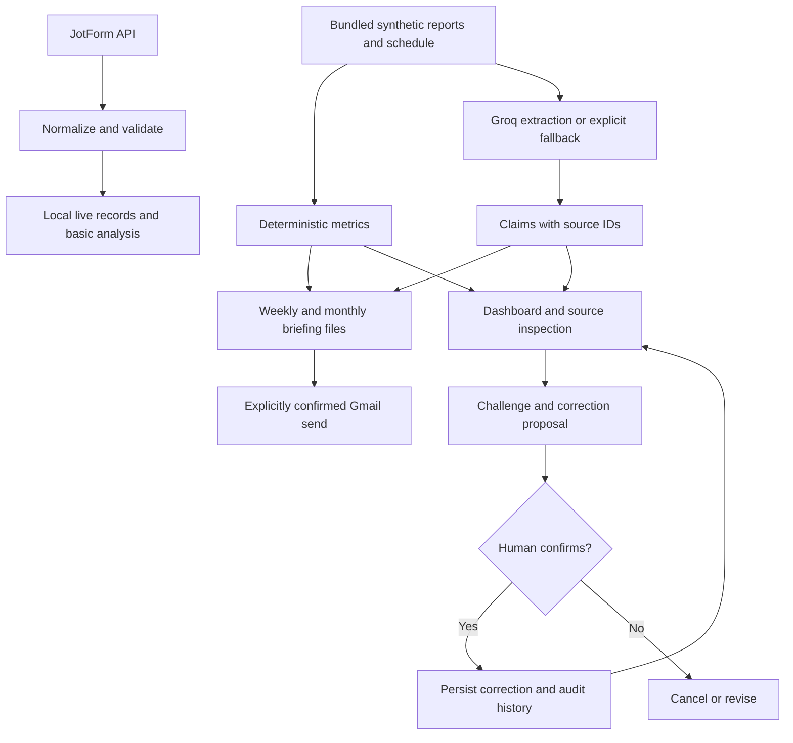

# Architecture Overview

ShiftNotes is designed around one product decision: preserve the manager's
existing email workflow instead of forcing a new daily dashboard workflow.

## Core Flow

This is the intended composition of the implemented components. The live fetch
path and the bundled dashboard dataset are currently separate; this diagram does
not imply an unattended production job. See [integrations](INTEGRATIONS.md).

```text
JotForm API or JotForm-shaped reports
-> normalization and validation
-> deterministic metrics
-> semantic extraction for free text
-> source-backed claim catalog
-> weekly/monthly briefing
-> Gmail delivery
-> optional dashboard inspection and correction
```

## Main Components

- `demo/src/shiftnotes/jotform_client.py` fetches JotForm submissions.
- `demo/src/shiftnotes/normalize.py` turns submissions into clean records.
- `demo/src/shiftnotes/baseline.py` calculates deterministic metrics and
  completeness.
- `demo/src/shiftnotes/semantic.py` extracts source-backed semantic signals.
- `demo/src/shiftnotes/briefings.py` renders weekly and monthly briefings.
- `demo/src/shiftnotes/email_preview.py` creates HTML and plain-text emails.
- `demo/src/shiftnotes/gmail_delivery.py` sends confirmed briefings through
  Gmail.
- `demo/src/shiftnotes/product.py` builds claims, source bundles, and correction
  records.
- `demo/src/shiftnotes/correction_graph.py` handles HITL correction confirmation.
- `demo/app.py` provides the Streamlit inspection workspace.
- `demo/src/shiftnotes/dashboard.py` calculates date/kiosk-filtered metrics and
  aggregates weekly claim sources without double-counting monthly claims.
- `demo/src/shiftnotes/dashboard_view.py` renders the dashboard and comparison
  views, retaining the existing briefing, source, and correction screens.



The live-to-rich-dataset handoff remains future integration work. The archived
team RAG experiment is not the retrieval path of this app: current source
inspection is a lookup by submission ID. The separate teaching graph retains
its pre-finalization approval demonstration; product corrections happen after
briefing review.

## Why Email First

The hardest architectural decision was whether to build a centralized dashboard
or optimize the flow Ted already uses. A dashboard is cleaner from a software
perspective, but it risks creating adoption friction. The email-first design
lets Ted receive one high-value briefing and only open the dashboard when he
wants to inspect or challenge something.

This was a product design decision before it was a code decision. The goal is
not to show off a dashboard; the goal is to reduce the amount of manual report
review required inside an existing operations workflow.

## Grounding Strategy

ShiftNotes separates exact metrics from semantic interpretation.

Python calculates ratings, dates, missing reports, duplicate handling, and waste
counts. The LLM only interprets free-text fields such as guest issues,
operational notes, recognition, and food concerns.

Every semantic signal must include:

- source submission ID;
- source field name;
- exact evidence excerpt;
- category;
- confidence;
- sensitivity flag.

If the evidence excerpt is not present in the original source field, the result
is rejected.

## Failure Handling

Malformed AI output, empty responses, provider errors, and unsupported evidence
trigger retry logic. Repeated failures route to a deterministic fallback so the
briefing pipeline can continue with lower flexibility but higher reliability.

Failed model results are not cached.

## Test Boundaries

The active tests are organized around the failure points that would matter most
if the core workflow broke:

- normalization tests catch JotForm cleaning regressions;
- semantic extraction tests catch unsupported evidence, malformed output,
  retries, fallback, and cache behavior;
- briefing tests catch broken weekly/monthly summaries and source-backed
  sections;
- Gmail tests catch malformed messages and send invocation errors;
- product and LangGraph tests catch claim inspection, correction, checkpoint,
  and stateful workflow regressions.

## Human-In-The-Loop

The production-style HITL step happens after delivery. Ted can challenge a
claim, inspect the source bundle, review a proposed correction, and confirm or
cancel that correction. A challenge does not automatically rewrite future
classification rules.

## Scaling Path

The demo uses local files and SQLite because that is enough to prove the
workflow. A production version would need authentication, tenant isolation,
database-backed storage, background workers, scheduled jobs, API rate-limit
handling, monitoring, audit logging, and managed secrets.
