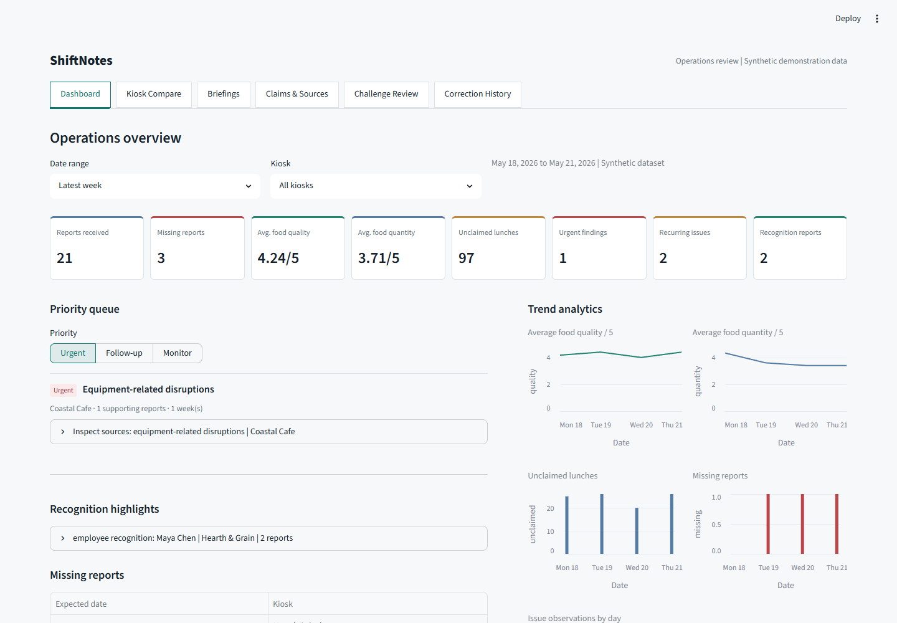

# See ShiftNotes in Action

The screenshots and recording show the actual Streamlit app using the bundled
synthetic reports. No mailbox, credentials, or private workplace data appear.

[Open the hosted demo](https://shiftnotes.streamlit.app) |
[Watch the continuous workflow recording](workflow.webm)


The GIF cycles through captured UI stages; the WebM is the continuous browser
recording. They show the following sequence:

1. Read the weekly HTML email preview. This is a preview, not a new email send.
2. Review weekly metrics and prioritized findings in the dashboard.
3. Expand the view to the full 12-week reporting period.
4. Compare kiosk ratings, completeness, and unclaimed lunches per report.
5. Filter to Bowls & Buns and inspect the supporting report fields.
6. Follow a source link into the challenge workflow.
7. Review a proposed source removal at the human confirmation checkpoint.
8. Cancel the proposal and inspect the audit-history entry.

The challenge is scripted to demonstrate review controls, not to assert that the
original analysis was wrong. The default actor name shown in history is demo
application metadata, not evidence that Ted performed this recorded review.

## Screenshots



| View | What to inspect |
| --- | --- |
| [Weekly email](briefing.png) | The manager's main interface: briefing metrics and findings |
| [Three-month view](trends.png) | Aggregated trends and reporting coverage |
| [Kiosk comparison](comparison.png) | Quality ratings, missing reports, and unclaimed lunches per report |
| [Single kiosk](kiosk.png) | Filters applied to metrics and source-backed findings |
| [Supporting sources](sources.png) | Original normalized report text behind a finding |
| [Correction checkpoint](correction.png) | Original and proposed claim before confirmation |
| [Decision history](history.png) | Canceled proposal preserved for auditability |

## Run the Demo

From the repository root, run `uv sync --locked`, then
`uv run streamlit run streamlit_app.py`. No API keys are needed for the synthetic
workflow. Actual Gmail sending is a separate, explicitly authorized command.

## Reproduce the Captures

Use a disposable checkout with no `demo/.env`, credentials, correction history,
or checkpoint files. Capturing the cancellation creates local audit data in that
checkout. Never run this capture workflow against a live workplace instance.

First terminal, from the disposable checkout:

```powershell
uv sync --locked
uv run python demo/src/shiftnotes/cli.py product-assets --base-url http://localhost:8503
uv run streamlit run streamlit_app.py --server.port=8503
```

Second terminal, from the same checkout (Windows with Microsoft Edge installed):

```powershell
npm install --prefix dist/demo-tools --no-save --package-lock=false playwright@1.62.1
$env:SHIFTNOTES_PLAYWRIGHT_MODULE = (Resolve-Path dist/demo-tools/node_modules/playwright).Path
$env:PLAYWRIGHT_BROWSERS_PATH = Join-Path (Get-Location) 'dist/demo-tools/browsers'
node dist/demo-tools/node_modules/playwright/cli.js install ffmpeg
node scripts/capture_demo.cjs
uv run python scripts/make_demo_gif.py
```

The script uses `http://localhost:8503` by default and writes media to `docs/demo/`.
`SHIFTNOTES_DEMO_URL` can select another isolated local instance.
`SHIFTNOTES_BROWSER_CHANNEL` defaults to `msedge`.
The [capture manifest](capture-manifest.json) records stages, selected claim,
source ID, and the cancellation outcome. Playwright is optional capture tooling,
not an application dependency. Intermediate recordings remain under ignored `dist/`.

See the [walkthrough](../DEMO_GUIDE.md), [metric definitions](../DASHBOARD_METRICS.md),
and [verification notes](../VERIFICATION.md).
