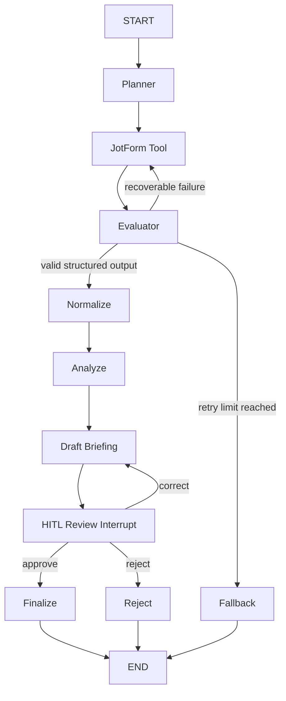

# Week 6 LangGraph Stateful Agent Checkpoint

## Purpose

The Week 6 workflow wraps the working ShiftNotes ingestion and analysis pipeline in
LangGraph. The same graph supports two ingestion modes:

- `demo`: reads safe JotForm-style fixture data.
- `live`: reads submissions from the configured JotForm API.

Only the input source changes. Normalization, evaluation, analysis, briefing,
routing, checkpointing, and human review use the same implementation.

## Architecture



## Node Roles

| Node | Responsibility |
| --- | --- |
| `planner` | Interprets run configuration and establishes mode, expected kiosks, limits, and retry policy. |
| `ingest_tool` | Invokes either the JotForm API or safe demo fixture and returns a structured tool result. |
| `evaluator` | Checks tool success and submission count, then selects continue, retry, or fallback. |
| `normalize` | Converts JotForm answers into validated ShiftNotes report records. |
| `analyze` | Calculates metrics, detects missing reports, and produces source-backed claims. |
| `draft_briefing` | Renders a readable briefing and incorporates human correction notes. |
| `human_review` | Interrupts execution before finalization and accepts approve, correct, or reject. |
| `finalize` | Stores the approved briefing. Email delivery remains intentionally disabled. |
| `reject` | Ends the workflow without creating an approved briefing. |
| `fallback` | Stops after repeated tool failures and records the reason for manual review. |

## Structured Tool Output

The ingestion tool records:

```json
{
  "success": true,
  "source": "demo fixture or JotForm API",
  "submission_count": 4,
  "error": ""
}
```

The evaluator routes using this object rather than relying on generated prose.

## Conditional Routing

| Runtime condition | Route |
| --- | --- |
| Tool succeeds and returns at least one submission | `normalize` |
| Tool fails and retry count is below the limit | Back to `ingest_tool` |
| Tool fails after the configured retry limit | `fallback` |
| Human selects `approve` | `finalize` |
| Human selects `correct` with a note | `draft_briefing`, then another interrupt |
| Human selects `reject` | `reject` |

## Self-Correction and Stop Conditions

The default retry limit is two retries after the first attempt. Every failure,
retry reason, and attempt number is added to `execution_log`.

The graph stops retrying when:

- ingestion succeeds, or
- `retry_count == max_retries`.

Repeated failures route to `fallback`; they never continue into analysis with
missing or malformed input.

## HITL Decision

The graph interrupts after a draft briefing is created and before it is
finalized. This is the high-impact boundary because the briefing may contain
operational or personnel-related claims.

The reviewer can:

- `approve`: finalize the briefing.
- `correct`: attach a correction, regenerate the draft, and review it again.
- `reject`: end without finalization.

No email is sent by the Week 6 checkpoint.

## Stateful Persistence

Production CLI runs use LangGraph's SQLite checkpointer. Each run receives a
stable `thread_id`. The process can close while waiting for review; a later
process can load the same checkpoint and resume it.

Tests use an in-memory checkpointer except for one persistence test that:

1. Starts and interrupts a workflow.
2. Closes the graph and SQLite connection.
3. Builds a new graph using the same database.
4. Resumes and finalizes the original thread.

## Key Files

- `src/shiftnotes/graph.py`: graph construction and SQLite persistence.
- `src/shiftnotes/graph_state.py`: shared workflow state.
- `src/shiftnotes/graph_nodes.py`: node logic, routing, retry, and HITL.
- `src/shiftnotes/cli.py`: start, inspect, and resume commands.
- `data/demo/jotform_submissions.json`: safe demonstration fixture.
- `tests/test_langgraph_workflow.py`: orchestration tests.
- `evidence/week6/`: execution evidence.

## Official References

- https://docs.langchain.com/oss/python/langgraph/persistence
- https://docs.langchain.com/oss/python/langgraph/interrupts
- https://docs.langchain.com/oss/python/langgraph/graph-api
